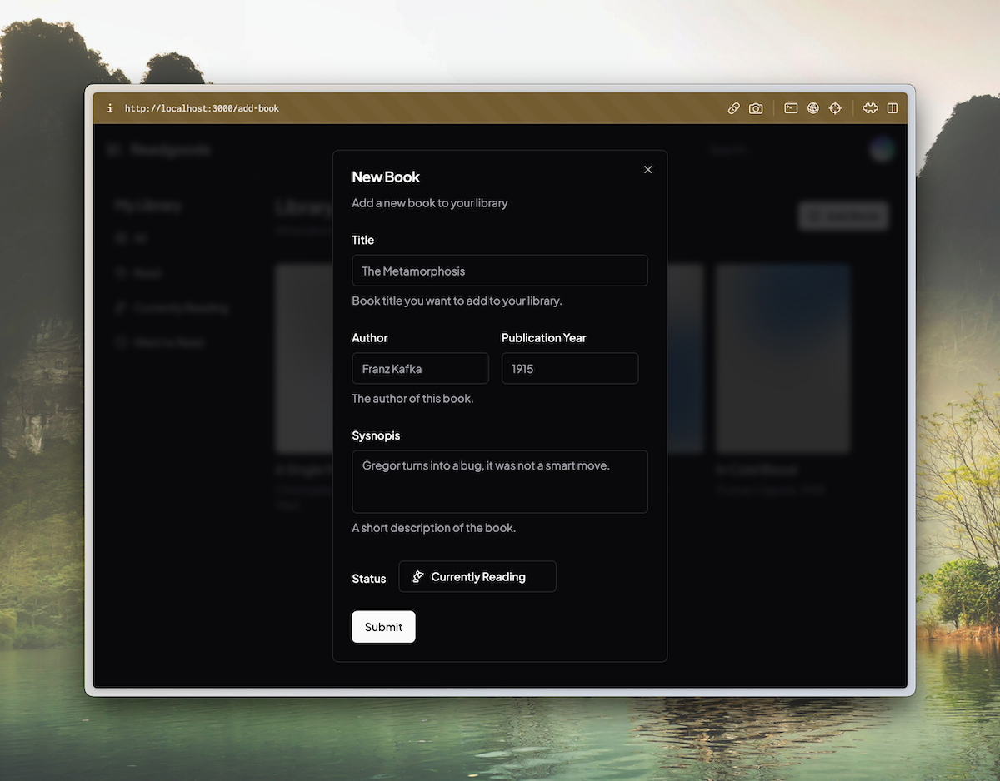

# 📚 Readgoods

https://readgoods.vercel.app/

A simple personal library management system, built with [Next's App Router](https://nextjs.org/docs), [shadcn/ui](https://ui.shadcn.com/) and [Prisma](https://www.prisma.io/).



## Features

- GitHub OAuth.
- Book management.
- [Parallel + intercepting routes](https://nextjs.org/docs/app/building-your-application/routing/intercepting-routes#modals).
- Postgres with Prisma.

## Development

Create a `.env` file from `.env.example`.

You can connect to a Vercel's [Postgres addon](https://vercel.com/docs/storage/vercel-postgres/quickstart) and run `vercel env pull .env` to automatically fill in `POSTGRES` variables.

Readgoods use [Auth.js](https://authjs.dev/) for authentication. Following [this guide](https://next-auth.js.org/providers/github) to setup GitHub OAuth.

Finally, run the development server:

```bash
npm run dev
# or
yarn dev
# or
pnpm dev
```

Open [http://localhost:3000](http://localhost:3000) with your browser to see the result.
